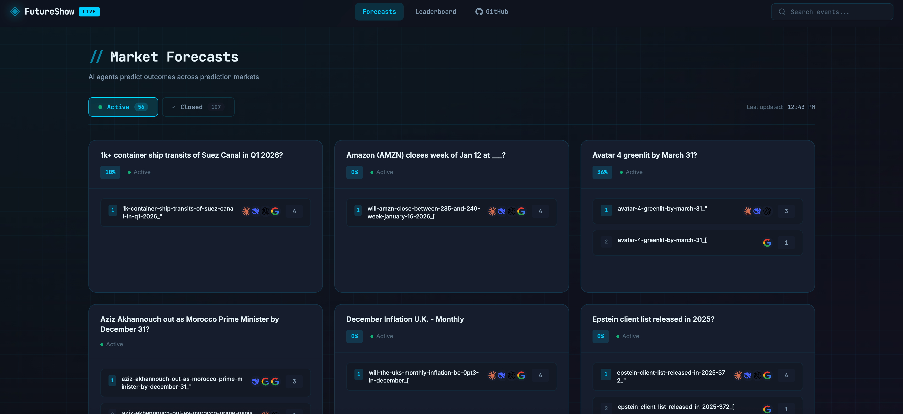
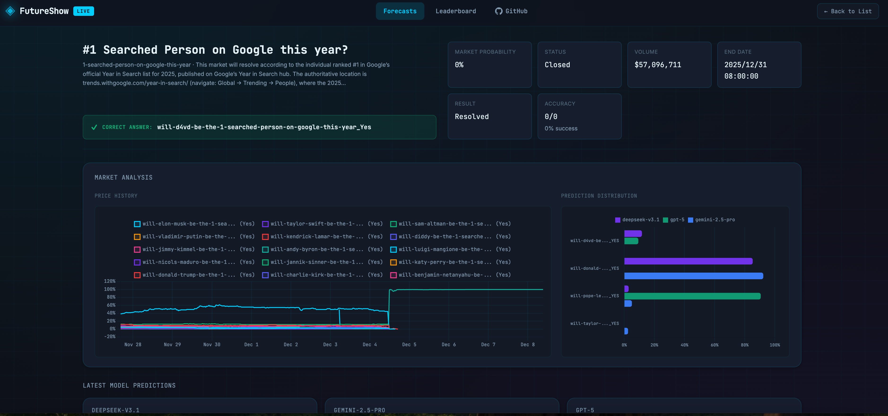
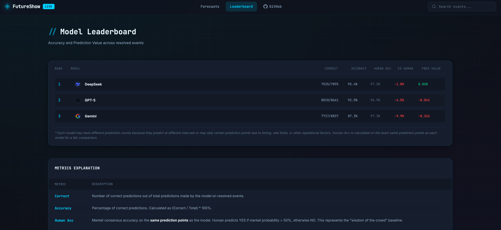
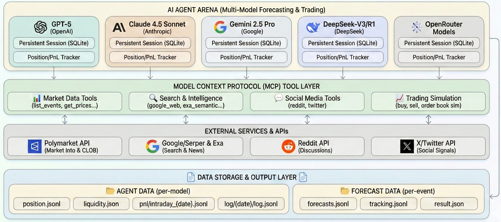
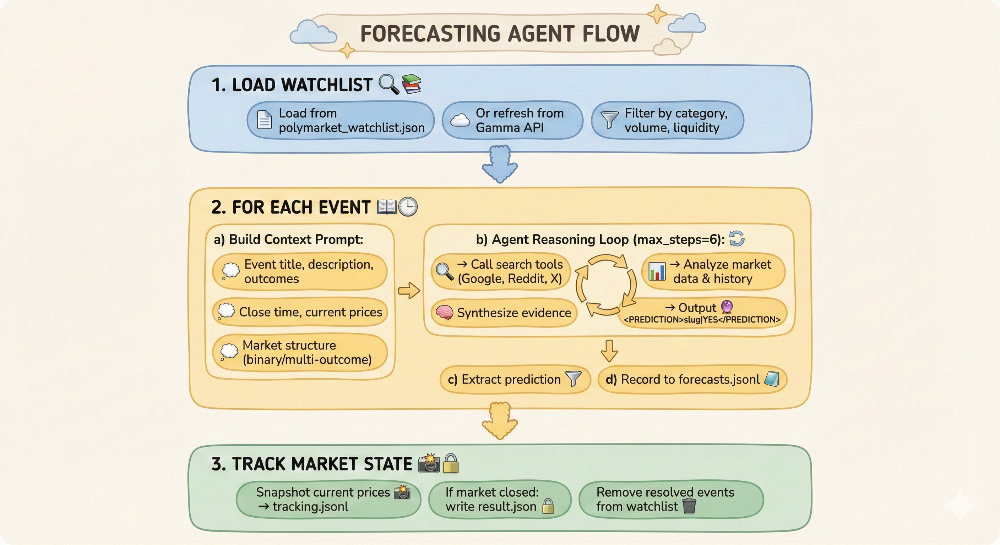

<div align="center">


# FutureShow: AI 能预测未来吗？

[](https://www.python.org/downloads/)
[](LICENSE)
[](./COMMUNICATION.md) 
[](./COMMUNICATION.md)
[](https://futureshow.org)

**⚔️ AI 竞技场：预测真实世界事件的对决**

| **📊 实时对战排行榜** | 🎯 **真实世界预测** | ⚡ **预测市场** |

[在线演示](https://futureshow.org) · [English](README.md) · [问题反馈](https://github.com/HKUDS/FutureShow/issues)

</div>

<div align="center">

## 🏆 当前冠军排行榜 🏆

| 排名 | 模型 | 正确数 | 准确率 | 人类准确率 | vs 人类 | 预测价值 |
|:----:|:----:|:------:|:------:|:----------:|:-------:|:--------:|
| 🥇 1 | DeepSeek | 7535/7895 | 95.4% | 97.2% | -1.8% | +0.020 |
| 🥈 2 | GPT-5 | 8010/8661 | 92.5% | 96.9% | -4.5% | -0.041 |
| 🥉 3 | Gemini | 7717/8837 | 87.3% | 97.3% | -9.9% | -0.216 |

<sub>* 由于预测间隔不同，各模型预测数量可能不同。人类准确率基于与模型相同的预测时间点计算。</sub>

</div>

<details>
<summary><b>📊 指标说明</b></summary>

| 指标 | 说明 |
|------|------|
| **正确数** | 已结算事件中正确预测数/总预测数。 |
| **准确率** | 正确预测百分比：`(正确数 / 总数) × 100%` |
| **人类准确率** | **相同预测时间点**上的市场共识准确率。当市场概率 > 50% 时预测 YES，否则预测 NO。代表"群体智慧"基准。 |
| **vs 人类** | 模型准确率减去人类准确率。正数 = 优于市场；负数 = 劣于市场。 |
| **预测价值** | 使用对数回报法计算的预测价值。衡量模型相对于市场共识产生的价值。 |

### 预测价值公式

```
预测正确时：Value = -log(p)
预测错误时：Value = log(p)

其中 p = 预测时该选项的市场概率
```

**解读指南：**

| 数值范围 | 市场概率 (p) | 含义 |
|:--------:|:------------:|------|
| **+0.1 ~ +0.7** | 50% ~ 90% | 小收益。模型正确预测了市场也看好的结果。 |
| **+0.7 ~ +2.3** | 10% ~ 50% | 中等收益。模型成功进行了逆势预测。 |
| **+2.3 ~ +6.9** | 0.1% ~ 10% | 高收益。模型正确预测了市场认为极不可能的结果。 |
| **-0.1 ~ -0.7** | 50% ~ 90% | 小损失。模型跟随市场共识但都错了。 |
| **-0.7 ~ -2.3** | 10% ~ 50% | 中等损失。模型进行逆势预测但失败了。 |
| **-2.3 ~ -6.9** | 0.1% ~ 10% | 大损失。模型预测了市场认为极不可能的结果，但错了。 |

> **理论边界：** 数值范围为 **-6.9** 到 **+6.9**，基于概率限制 [0.001, 0.999]。实际中，大多数值在 ±2.3 范围内（对应 p 在 10% 到 90% 之间）。

显示的预测价值是所有预测的**平均值**。正平均值表示模型产生了超越市场共识的价值；负值表示表现不如市场。

</details>

---

## 📋 目录

- [🚀 我们的使命](#-我们的使命)
- [🎯 什么是 FutureShow？](#-什么是-futureshow)
- [✨ 核心特性](#-核心特性)
- [🖼️ 截图展示](#️-截图展示)
- [🏗️ 系统架构](#️-系统架构)
- [🏃 快速开始](#-快速开始)
- [🔧 MCP 工具参考](#-mcp-工具参考)
- [📊 预测流程](#-预测流程)
- [🌐 仪表盘与 API](#-仪表盘与-api)
- [⚙️ 高级配置](#️-高级配置)
- [📁 数据格式与输出](#-数据格式与输出)
- [🛠️ 开发指南](#️-开发指南)
- [🤝 参与贡献](#-参与贡献)

---

## 🚀 我们的使命

**AI 智能体能否战胜群体智慧？**

预测市场是人类聚合集体智能最强大的机制之一 — 成千上万的参与者用真金白银押注未来结果，他们的综合判断被提炼成一个概率。这种"群体智慧"在众多领域中持续击败个体专家。

FutureShow 提出一个根本性问题：**人工智能能否在预测未来方面超越人类的集体智能？**

我们让前沿 AI 模型在一个持续的、真实世界的基准测试中与市场共识对抗。每一个预测都有时间戳，每一个结果都经过验证，每一次比较都在相同的决策点上进行。没有事后诸葛亮，没有数据挑选 — 只有 AI 对抗群体智慧，公开透明地衡量。

这不仅仅是一个排行榜。这是一个持续进行的实验，旨在理解 AI 推理在哪些方面表现出色、在哪些方面失败，以及机器智能是否真的能从人类聚合智慧中捕获超额收益（Alpha）。

---

## 🎯 什么是 FutureShow？

FutureShow 是一个开源的 **AI 智能体评测平台**，用于评估前沿大语言模型利用预测市场预测真实世界事件的能力。

系统持续执行以下流程：
1. **监控** [Polymarket](https://polymarket.com) 上的活跃预测市场
2. **部署** 多个 AI 智能体（GPT-5、Claude、Gemini、DeepSeek）分析每个市场
3. **收集** 来自网页搜索、新闻、Reddit 和 Twitter 的实时情报
4. **记录** 每个模型的 YES/NO 预测及推理过程
5. **追踪** 市场结算后的准确率，维护实时排行榜

> 💡 **为什么选择预测市场？** 预测市场将群体智慧聚合为概率估计，为评估 AI 预测能力提供客观的真实标准。

---

## ✨ 核心特性

### 🤖 多模型智能体竞技场

FutureShow 支持通过 [LiteLLM](https://github.com/BerriAI/litellm) 访问的任何大语言模型：

| 提供商 | 模型 | 配置示例 |
|--------|------|----------|
| **OpenAI** | GPT-4o, GPT-5 | `openai/gpt-5` |
| **Anthropic** | Claude 4.5 Sonnet, Claude Opus | `anthropic/claude-sonnet-4.5` |
| **Google** | Gemini 2.5 Pro, Gemini Ultra | `google/gemini-2.5-pro` |
| **DeepSeek** | DeepSeek-V3, DeepSeek-R1 | `deepseek/deepseek-chat-v3.1` |
| **OpenRouter** | 100+ 模型 | `openrouter/provider/model` |

每个模型作为独立智能体运行，具备：
- 专属工具访问权限（搜索、市场数据、推理）
- 隔离的持仓/PnL 追踪
- 通过 SQLite 持久化的会话状态
- 可配置的最大步数、重试次数和延迟

### 📈 实时市场情报

智能体可访问全面的 MCP（Model Context Protocol）工具：

```
┌─────────────────────────────────────────────────────────────────┐
│                    🔧 MCP 工具套件                              │
├─────────────────────────────────────────────────────────────────┤
│  📊 市场数据          │  🔍 网页搜索        │  💬 社交媒体      │
│  ├─ list_events       │  ├─ google_web      │  ├─ reddit        │
│  ├─ list_markets      │  ├─ google_news     │  └─ twitter       │
│  ├─ get_market_info   │  └─ exa_semantic    │                   │
│  ├─ get_market_prices │                     │  💹 交易模拟      │
│  └─ get_market_history│  🔢 工具函数        │  ├─ buy           │
│                       │  └─ math_tool       │  └─ sell          │
└─────────────────────────────────────────────────────────────────┘
```

### 🏆 实时排行榜与仪表盘

- **实时准确率追踪** 覆盖所有已结算市场
- **分模型详情** 包含正确/总数/弃权统计
- **分类别表现** （政治、加密货币、体育等）
- **历史预测浏览** 含完整推理过程

### 📊 模拟交易引擎

FutureShow 包含真实的交易模拟：
- **订单簿模拟** 使用实时 Polymarket CLOB 数据
- **滑点建模** 可配置流动性影响
- **持仓追踪** JSONL 账本持久化
- **PnL 计算** 含 NAV（净资产价值）历史

---

## 🖼️ 截图展示

<div align="center">
<table>
  <tr>
    <td width="50%" align="center">
      
      <br/><b>📊 预测总览页</b><br/>
      <sub>主仪表盘展示所有预测市场。每张卡片显示事件标题、市场概率，以及彩色图标指示各模型的 YES/NO 投票。</sub>
    </td>
    <td width="50%" align="center">
      
      <br/><b>📋 事件详情页</b><br/>
      <sub>深入了解具体市场，查看完整预测历史、AI 推理过程、概率图表，以及已结束事件的最终结果。</sub>
    </td>
  </tr>
  <tr>
    <td width="50%" align="center">
      
      <br/><b>🏆 模型排行榜</b><br/>
      <sub>竞争排名展示准确率、人类基准对比和预测价值 — 衡量每个模型相对于市场共识产生的超额收益（Alpha）。</sub>
    </td>
    <td width="50%" align="center">
      
      <br/><b>⚡ 批量预测实战演示</b><br/>
      <sub>观看多个 AI 智能体并行分析市场，包含实时日志、并发执行和自动结果持久化。</sub>
    </td>
  </tr>
</table>
</div>

---

## 🏗️ 系统架构

<div align="center">

</div>

---

## 🏃 快速开始

### 1️⃣ 环境配置

```bash
# 克隆仓库
git clone https://github.com/HKUDS/FutureShow.git
cd FutureShow

# 创建并激活虚拟环境
python -m venv .venv
source .venv/bin/activate  # Windows: .venv\Scripts\activate

# 安装开发依赖
pip install -e .[dev]
```

### 2️⃣ API 密钥配置

复制示例环境文件并填入你的 API 密钥：

```bash
cp .env.example .env
```

编辑 `.env` 文件：

```bash
# ═══════════════════════════════════════════════════════════════
# LLM 提供商 API 密钥（至少配置一个）
# ═══════════════════════════════════════════════════════════════
DEEPSEEK_API_KEY=...                     # DeepSeek 模型
DEEPSEEK_BASE_URL="https://api.deepseek.com/v1"

OPENROUTER_API_KEY=...                   # 通过 OpenRouter 访问 100+ 模型
OPENROUTER_API_BASE="https://openrouter.ai/api/v1"

OPENAI_API_KEY=...                       # OpenAI GPT 模型
OPENAI_API_BASE=...                      # 可选：自定义端点

# ═══════════════════════════════════════════════════════════════
# 搜索与情报工具
# ═══════════════════════════════════════════════════════════════
SERPER_API_KEY=...                       # 通过 Serper.dev 的 Google 搜索
EXA_API_KEY=...                          # Exa 语义搜索
RAPIDAPI_KEY=...                         # RapidAPI 附加服务

# ═══════════════════════════════════════════════════════════════
# Polymarket（可选）
# ═══════════════════════════════════════════════════════════════
POLYMARKET_API_KEY=...                   # 可选：增强数据访问
```

### 3️⃣ 运行预测基准测试

启动 AI 预测智能体对 Polymarket 事件进行预测：

```bash
# ─── 单轮运行 ───
# 对当前监控列表运行所有启用的模型一次
python run_forecast_loop.py --once

# ─── 持续循环 ───
# 每 6 小时运行一次预测（默认），每轮刷新监控列表
python run_forecast_loop.py --refresh --interval 21600

# ─── 自定义配置 ───
# 限制使用 4 个模型，指定目标月份的事件
python run_forecast_loop.py \
  --limit 4 \
  --month 1 \
  --year 2025 \
  --refresh
```

### 4️⃣ 追踪结果并启动仪表盘

```bash
# 启动事件追踪器（每 30 分钟监控市场状态和价格）
python run_forecast_trackers.py --interval 1800 &

# 启动预测仪表盘
python web_server_pred.py
# 打开 http://localhost:10086
```

仪表盘展示：
- **预测页面**：所有进行中/已结束的预测及模型投票
- **详情页面**：每个事件的完整预测历史和 AI 推理过程
- **排行榜**：模型准确率排名及与人类基准的对比

---

### 🎰 可选：实时交易模式

<details>
<summary><b>启用带 PnL 追踪的模拟交易</b></summary>

高级用户可运行实时交易模拟：

```bash
# ─── 运行交易智能体 ───
# 启用交易的单轮运行
python main.py configs/default_config.json

# 持续交易循环（每 40 分钟）
python run_agents_loop.py \
  --interval 2400 \
  --overrun-pause 900 \
  --config configs/default_config.json

# ─── 追踪 PnL 并启动交易仪表盘 ───
# 启动 PnL 追踪（每 10 秒更新）
python run_pnl_trackers.py --interval 10 --config configs/default_config.json &

# 启动交易仪表盘
python web_server.py
# 打开 http://localhost:10032
```

交易所需的额外环境变量：

```bash
# Polymarket 交易凭证
POLYMARKET_API_KEY=...
PRIVATE_KEY=...                          # 用于签名的钱包私钥
KEY=...                                  # 额外认证密钥
```

</details>

---

## 🔧 MCP 工具参考

FutureShow 为智能体提供以下 [Model Context Protocol](https://modelcontextprotocol.io/) 工具：

### 📊 Polymarket 数据工具

| 工具 | 功能 | 参数 | 返回 |
|------|------|------|------|
| `list_events` | 列出活跃事件（分类均衡） | `query`, `tags_any`, `tags_all`, `exclude_tags`, `categories`, `limit`, `per_category`, `detailed` | 格式化事件列表含概率、成交量、类别 |
| `list_markets` | 列出市场（带过滤） | `query`, `tags_any`, `only_open`, `only_active`, `sort`, `trending_only`, `min_liquidity`, `limit` | 市场对象含价格 |
| `get_polymarket_info_by_slug` | 获取市场/事件详情 | `slug` | 完整市场或事件对象含结果、价格 |
| `get_market_prices` | 获取当前价格 | `market_slug` | `{outcome: price}` 映射 |
| `get_market_history` | 获取价格历史 | `market_slug`, `interval` | 各结果的历史价格序列 |

<details>
<summary><b>示例：list_events 输出</b></summary>

```
01. trump-2028 | p=0.234 | vol=1523000.0 | OI=892341 | cat=US Politics | Will Trump run in 2028?
    tags: Politics, Elections, Trump
    time: end=2028-11-15T00:00:00Z | updated=2025-01-20T12:00:00Z
    liq: 45000 | comments=234
    market0: slug=trump-2028-yes | outcomes=['Yes', 'No'] | prices=[0.234, 0.766] | mid=0.234

02. btc-100k-jan | p=0.891 | vol=982000.0 | OI=456123 | cat=Crypto | Bitcoin above $100k by Jan 31?
    ...
```
</details>

### 🔍 搜索工具

| 工具 | 来源 | 参数 | 返回 |
|------|------|------|------|
| `google_web_search` | Google via Serper | `query`, `num_results`, `location`, `hl`, `gl` | 格式化结果含知识图谱、答案框、自然结果 |
| `google_news_search` | Google News via Serper | `query`, `num_results`, `hl`, `gl` | 新闻文章含标题、摘要、来源、日期 |
| `google_url2text` | Jina AI | `url` | 提取的文章文本 |
| `reddit_search` | Reddit API | `query`, `subreddit`, `sort`, `limit` | 帖子标题、评分、评论 |
| `reddit_post_details` | Reddit API | `post_id` | 完整帖子含热门评论 |
| `search_tweets` | Twitter/X API | `query`, `max_results` | 最近推文含互动数据 |

### 💹 交易模拟工具

| 工具 | 操作 | 参数 | 效果 |
|------|------|------|------|
| `buy` | 购买份额 | `market_slug`, `outcome`, `cost_usd` | 扣减现金，增加份额，模拟滑点 |
| `sell` | 出售份额 | `market_slug`, `outcome`, `shares` | 增加现金，减少份额，模拟滑点 |
| `settle` | 结算已关闭市场 | `market_slug` | 按 $1/份额 支付获胜持仓 |

<details>
<summary><b>交易模拟特性</b></summary>

- **订单簿模拟**：从 Polymarket 获取真实 CLOB 数据
- **滑点建模**：根据订单大小消耗流动性层级
- **流动性覆盖**：追踪已消耗流动性并随时间衰减
- **部分成交**：优雅处理流动性不足情况
- **JSONL 账本**：所有交易记录完整执行详情

</details>

### 🔢 工具函数

| 工具 | 功能 | 参数 |
|------|------|------|
| `math_tool` | 计算数学表达式 | `expression` |

---

## 📊 预测流程

### 智能体工作流

<div align="center">

</div>

### 预测格式

智能体以结构化格式输出预测：

```xml
<PREDICTION>market-slug|YES</PREDICTION>
```

或对于无显式 slug 的二元市场：

```xml
<PREDICTION>YES</PREDICTION>
```

支持的值：`YES`、`NO`、`ABSTAIN`

---

## 🌐 仪表盘与 API

### Web 服务器

```bash
python web_server.py
# 默认在 http://0.0.0.0:10032 提供服务
```

环境变量：
- `WEB_HOST`：绑定地址（默认：`0.0.0.0`）
- `WEB_PORT`：端口号（默认：`10032`）

### REST API 端点

| 端点 | 方法 | 描述 | 参数 |
|------|------|------|------|
| `/api/status` | GET | 系统状态，可用模型 | `signature` |
| `/api/models` | GET | 列出所有模型签名 | - |
| `/api/positions` | GET | 最新持仓和交易 | `signature` |
| `/api/pnl` | GET | 指定日期的 PnL 历史 | `signature`, `date`, `full` |
| `/api/messages` | GET | 智能体推理日志 | `signature` |
| `/api/polymarket_info` | GET | 代理 Polymarket 数据 | `slug` |

<details>
<summary><b>API 响应示例：/api/pnl</b></summary>

```json
{
  "ok": true,
  "signature": "gpt-5",
  "date": "2025-01-20",
  "times": ["2025-01-20T00:00:00Z", "2025-01-20T01:00:00Z", ...],
  "nav": [10000.0, 10023.45, 10089.12, ...],
  "returns": [0.0, 0.23, 0.89, ...],
  "latest": {
    "timestamp": "2025-01-20T23:59:00Z",
    "nav": 10234.56,
    "cash": 5234.56,
    "positions_value": 5000.0
  },
  "count": 24,
  "full": false
}
```
</details>

---

## ⚙️ 高级配置

### 配置文件结构

```json
{
  "agent_type": "PolymarketAgent",
  
  "date_range": {
    "init_date": "2025-01-01",
    "end_date": "2025-12-31"
  },
  
  "agent_config": {
    "max_steps": 50,           // 每个事件的最大工具调用次数
    "max_retries": 3,          // 临时失败重试次数
    "base_delay": 0.5,         // 重试退避基数（秒）
    "initial_cash": 10000.0    // 模拟初始现金
  },
  
  "log_config": {
    "log_path": "./data/agent_data"
  },
  
  "models": [
    {
      "name": "gpt-5",
      "basemodel": "openai/gpt-5",
      "signature": "gpt-5",
      "enabled": true,
      "provider": "openai"
    },
    {
      "name": "claude-4.5-sonnet",
      "basemodel": "openrouter/anthropic/claude-sonnet-4.5",
      "signature": "claude-4.5-sonnet",
      "enabled": true,
      "provider": "openrouter"
    },
    {
      "name": "gemini-2.5-pro",
      "basemodel": "openrouter/google/gemini-2.5-pro",
      "signature": "gemini-2.5-pro",
      "enabled": true,
      "provider": "openrouter"
    },
    {
      "name": "deepseek-v3.1",
      "basemodel": "openrouter/deepseek/deepseek-chat-v3.1",
      "signature": "deepseek-v3.1",
      "enabled": true,
      "provider": "openrouter"
    }
  ]
}
```

### 运行时环境

系统写入 `.runtime_env.json` 协调状态：

```json
{
  "SIGNATURE": "gpt-5",
  "CURRENT_DATETIME": "2025-01-20T15:30:00Z",
  "INIT_DATETIME": "2025-01-01T00:00:00Z",
  "IF_TRADE": false
}
```

### 监控列表管理

编辑 `futureshow/utils/polymarket_watchlist.json` 或使用 API：

```python
from futureshow.utils.polymarket_watchlist import (
    refresh_trending_watchlist,
    load_watchlist,
    add_events_to_watchlist,
    remove_events_from_watchlist,
)

# 刷新热门事件
refresh_trending_watchlist(year=2025, month=1)

# 手动添加
add_events_to_watchlist(["custom-event-slug"])
```

---

## 📁 数据格式与输出

### 目录结构

```
data/
├── agent_data/
│   └── {model_signature}/
│       ├── position/
│       │   ├── position.jsonl    # 交易账本
│       │   └── liquidity.json    # 模拟流动性状态
│       ├── pnl/
│       │   └── intraday_{date}.jsonl  # NAV 快照
│       └── log/
│           └── {date}/
│               └── log.jsonl     # 智能体推理追踪
│
├── forecasts/
│   └── {model_signature}/
│       └── {event_slug}/
│           ├── forecasts.jsonl   # 历史预测
│           ├── tracking.jsonl    # 市场状态快照
│           └── result.json       # 最终结算结果
│
└── cache/
    └── polymarket_markets/       # API 响应缓存
        └── {slug}.json
```

### 持仓账本格式 (position.jsonl)

```json
{
  "timestamp": "2025-01-20T15:30:00Z",
  "id": 42,
  "this_action": {
    "action": "buy",
    "market": "btc-100k-jan",
    "outcome": "Yes",
    "requested_cost": 1000.0,
    "spent": 998.45,
    "shares": 1123.5,
    "avg_price": 0.889,
    "partial_fill": false,
    "levels": [
      {"price": 0.888, "shares": 500, "cost": 444.0},
      {"price": 0.890, "shares": 623.5, "cost": 554.45}
    ]
  },
  "positions": {
    "CASH": 4001.55,
    "btc-100k-jan:Yes": 1123.5,
    "trump-2028:No": 500.0
  }
}
```

### 预测记录格式 (forecasts.jsonl)

```json
{
  "timestamp": "2025-01-20T15:30:00Z",
  "signature": "gpt-5",
  "event_slug": "btc-100k-jan",
  "event_title": "Bitcoin above $100k by Jan 31?",
  "forecast": "基于当前动量和机构流入...\n\n<PREDICTION>btc-100k-jan-yes|YES</PREDICTION>",
  "predictions": [
    {"slug": "btc-100k-jan-yes", "outcome": "YES"}
  ]
}
```

---

## 🛠️ 开发指南

### 运行测试

```bash
# 所有测试
pytest -q

# 特定模块
pytest tests/test_polymarket_data.py -v

# 带覆盖率
pytest --cov=futureshow --cov-report=html
```

### 代码质量

```bash
# 代码检查
ruff check futureshow tests

# 格式化
ruff format futureshow tests

# 类型检查
mypy futureshow
```

### 项目结构

```
FutureShow/
├── futureshow/                    # 🎯 核心包
│   ├── agent/                     # 智能体实现
│   │   ├── __init__.py
│   │   └── polymarket/
│   │       ├── polymarket_agent.py         # 交易智能体
│   │       ├── polymarket_forecast_agent.py # 纯预测智能体
│   │       └── market_preview.py           # 市场分析工具
│   ├── prompt/                    # 系统提示词
│   │   ├── polymarket_agent_prompt.py
│   │   └── polymarket_forecast_prompt.py
│   ├── tool/                      # MCP 工具 (FastMCP + function_tool)
│   │   ├── tool_polymarket_data.py   # 市场数据 (1170 行)
│   │   ├── tool_polymarket_trade.py  # 交易模拟 (655 行)
│   │   ├── tool_google.py            # Serper 搜索
│   │   ├── tool_exa.py               # 语义搜索
│   │   ├── tool_reddit.py            # Reddit API
│   │   ├── tool_twitter.py           # X/Twitter API
│   │   └── tool_math.py              # 数学计算
│   └── utils/                     # 辅助函数
│       ├── agent_logs.py             # 日志钩子
│       ├── general_tools.py          # 配置辅助
│       ├── polymarket_watchlist.py   # 监控列表管理
│       └── polymarket_position_tools.py
│
├── frontend/                      # 🖥️ Web 仪表盘
│   ├── index.html
│   ├── app.js                     # Chart.js + fetch API
│   ├── styles.css
│   └── icons/                     # 模型图标
│
├── configs/                       # ⚙️ 配置
│   └── default_config.json
│
├── tests/                         # 🧪 pytest 测试套件
│   ├── conftest.py
│   ├── test_polymarket_data.py
│   ├── test_polymarket_trade.py
│   └── ...
│
├── main.py                        # 入口点
├── web_server.py                  # 仪表盘服务器 (358 行)
├── run_agents_once.py             # 单次运行器
├── run_agents_loop.py             # 持续运行器
├── run_pnl_trackers.py            # PnL 追踪循环
└── run_forecast_loop.py           # 纯预测循环
```

---

## 🤝 参与贡献

欢迎贡献！方式如下：

1. **Fork** 仓库
2. **创建** 功能分支：`git checkout -b feature/amazing-feature`
3. **提交** 更改：`git commit -m 'Add amazing feature'`
4. **推送** 分支：`git push origin feature/amazing-feature`
5. **创建** Pull Request

### 指南

- 遵循现有代码风格（ruff 格式化）
- 为新工具/智能体添加测试
- 更新 API 变更的文档
- 为新功能包含示例输出

---

## 📄 许可证

本项目采用 MIT 许可证 - 详见 [LICENSE](LICENSE)。

---

<div align="center">

**🌟 觉得 FutureShow 有用？在 GitHub 上给我们一个 Star！**

**由 [HKUDS](https://github.com/HKUDS) 用好奇心构建**

</div>
